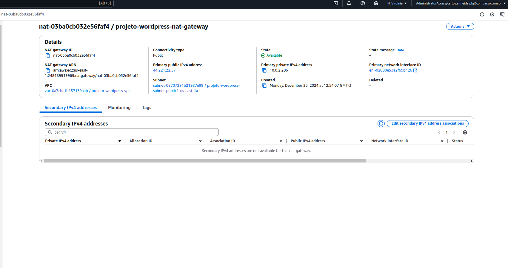
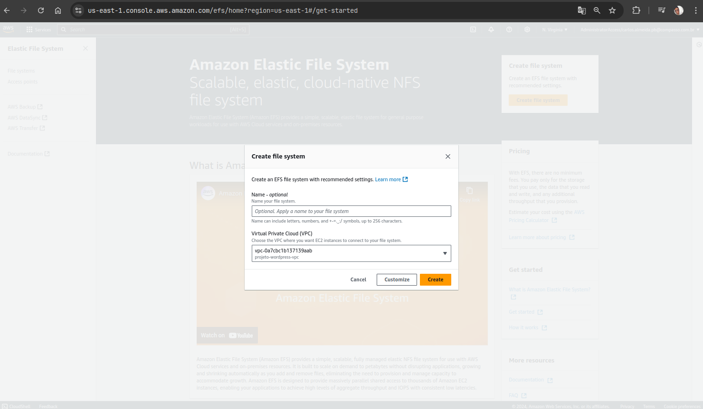
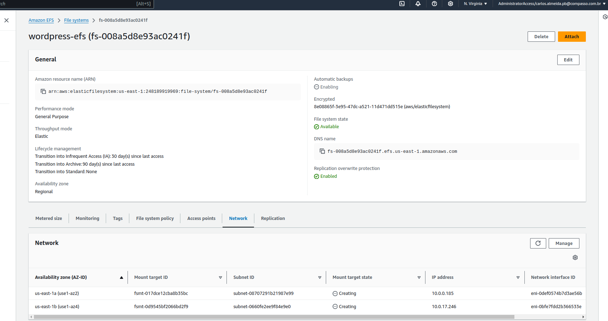
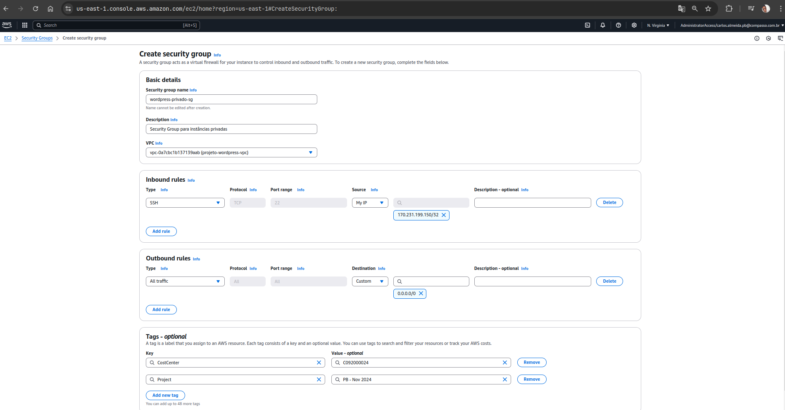
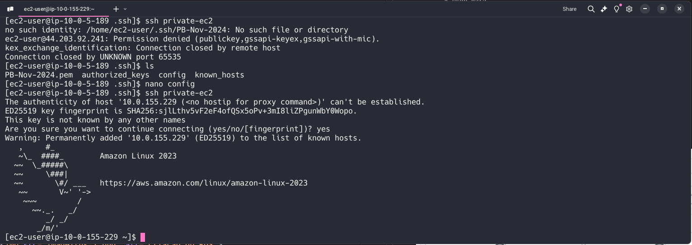
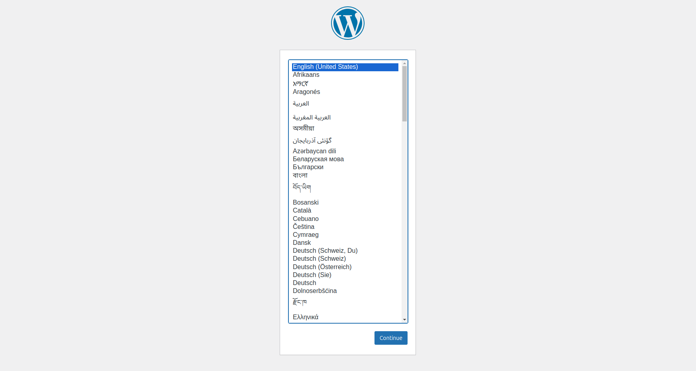
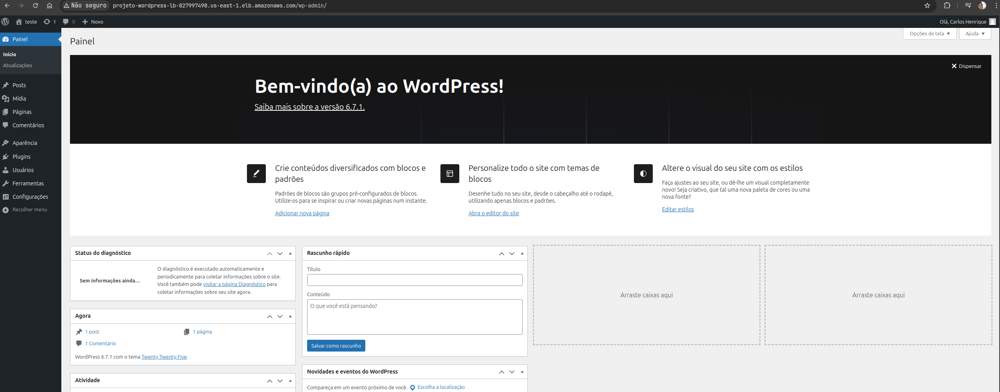

<h1 align="center">Documentação</h1>

## 📝 Sobre o projeto

  

Este projeto é desenvolvido com o intuito de criar uma infraestrutura na AWS utilizando uma VPC, Subnets, Security Groups, EC2, RDS e um Load Balancer, EFS, Bastion Host e Auto Scaling Group.

## Passo a passo para execução do projeto

### Pré-requisitos

- [Git](https://git-scm.com)
- [Conta na AWS](https://aws.amazon.com/pt/)
- [VSCode](https://code.visualstudio.com/)

<h1 align="center">Iniciando Implantação do Laboratório</h1>

### ☁ Criando a infraestrutura na AWS

#### 1. Primeiro passo é iniciar a criação da VPC

  

Na imagem acima, é possível visualizar a criação de uma VPC.

Configurações:

- Nome: `wordpress-vpc`
- CIDR Block: `10.0.0.0/16`
- IPv4 CIDR Block: `No IPv4 CIDR Block`
- Tenancy: `Default`
- Número de AZs: `2` (us-east-1a, us-east-1b)
- Número de subnets públicas: `2`
- Número de subnets privadas: `2`
- NAT Gateway: `none`
- VPC Endpoints: `S3`

  

Na imagem acima, a VPC foi criada com sucesso.

#### 2. Criando NAT Gateway

  

Para a instância privada acessar a internet, é necessário criar um NAT Gateway.

Configurações:

- Nome: `wordpress-nat-gateway`
- Subnet: `wordpress-public-subnet-a`
- Elastic IP: `Create new EIP`

Após a criação, é necessário configurar a rota na tabela de rotas da VPC.

Coloque o NAT Gateway como destino e a Internet Gateway como alvo na tabela de rotas da subnet privada

  

Após a configuração, é possível acessar a instância privada e instalar o Docker e o Docker Compose.

#### 3. Criando EFS

  

Clicando em `Create file system`, é possível visualizar a criação de um EFS.

Dê um nome ao EFS e selecione a VPC `wordpress-vpc`.

  

Na imagem acima, é possível visualizar a criação de um EFS.

#### 4. Criando Security Groups

  

Na imagem acima, é possível visualizar a criação de um Security Group.

Configurações:

O primeiro SG será privado:

- Nome: `wordpress-privado-sg`
- Descrição: `Security Group para instâncias privadas`
- Regras de entrada:
  - Type: `SSH`
  - Protocol: `TCP`
  - Port Range: `22`
  - Source: `0.0.0.0/0`
  - Type: `HTTP`
  - Protocol: `TCP`
  - Port Range: `80`
  - Source: `security group publico`
  - Type: `MySQL/Aurora`
  - Protocol: `TCP`
  - Port Range: `3306`
  - Source: `0.0.0.0/0`
  - Type: `HTTPS`
  - Protocol: `TCP`
  - Port Range: `443`
  - Source: `security group publico`

O segundo SG será público:

- Nome: `wordpress-publico-sg`
- Descrição: `Security Group para instâncias públicas`
- Regras de entrada:
  - Type: `SSH`
  - Protocol: `TCP`
  - Port Range: `22`
  - Source: `Anywhere IPv4`
  - Type: `HTTP`
  - Protocol: `TCP`
  - Port Range: `80`
  - Source: `0.0.0.0/0`

#### 5. Criando EC2 e Bastion Host

  

Na imagem acima, é possível visualizar a criação de uma EC2.

A primeira EC2 será o Bastion Host.

Configurações:

- AMI: `Amazon Linux 2023`
- Instance type: `t2.micro`
- Network: `wordpress-vpc`
- Subnet: `wordpress-public-subnet-a`
- Auto-assign Public IP: `Enable`
- Security Group: `wordpress-publico-sg`
- Key pair: `wordpress-key-pair`
- user data

A segunda EC2 será a instância privada.

Configurações:

- AMI: `Amazon Linux 2023`
- Instance type: `t2.micro`
- Network: `wordpress-vpc`
- Subnet: `wordpress-private1-subnet-a`
- Auto-assign Public IP: `Disable`
- Security Group: `wordpress-privado-sg`
- Key pair: `wordpress-key-pair`
- user data

A terceira EC2 será a instância privada.

Configurações:

- AMI: `Amazon Linux 2023`
- Instance type: `t2.micro`
- Network: `wordpress-vpc`
- Subnet: `wordpress-private2-subnet-b`
- Auto-assign Public IP: `Disable`
- Security Group: `wordpress-privado-sg`
- Key pair: `wordpress-key-pair`
- user data

  

Após a criação, é necessário acessar a instância Bastion Host e configurar o acesso à instância privada.

Para acessar o Bastion Host é necessário colocar o sg-privado como rota de entrada de SSH como anywhere ipv4.

#### 6. Criando RDS

  

Na imagem acima, é possível visualizar a criação de um RDS.

Selecionar o banco de dados MySQL.

Configurações:

- Engine options: `MySQL`
- Version: `MySQL 8.0.25`
- Templates: `Free tier`
- Settings:
  - DB instance identifier: `wordpress-db`
  - Master username: `admin`
  - Master password: `exemplosenha`
- DB instance size: `db.t2.micro`
- Storage: `20 GB`
- Connectivity:
  - VPC: `wordpress-vpc`
  - Subnet group: `wordpress-private-subnet-group`
  - Publicly accessible: `No`
  - VPC security group: `wordpress-sg`
- Additional configuration:
  - Initial database name: `wordpress`
- Desabilitando checks para evitar custo adicional.

  

RDS criado com sucesso.

Após a criação, é possível visualizar o endpoint do banco de dados.

Esse endpoint será utilizado para configurar o Wordpress.

No `docker-compose.yml`, é necessário alterar o endpoint, o nome do banco de dados, usuário e senha.

Acessando a EC2 e criando um banco chamado `wordpress` e alterando dentro do docker compose.

  

Após a configuração do banco de dados, é possível acessar o Wordpress.

Porém, agora é necessário criar um Load Balancer para acessar o Wordpress, um EFS e um Auto Scaling Group para garantir a alta disponibilidade do serviço.

#### 7. Criando Load Balancer

  

Na imagem acima, é possível visualizar a criação de um Load Balancer.

Configurações:

- Nome: `wordpress-lb`
- Scheme: `internet-facing`
- VPC: `wordpress-vpc`
- Availability Zones: `us-east-1a`, `us-east-1b` public subnet
- Listeners:
  - Protocol: `HTTP`
  - Port: `80`

  

Health checks:

- Protocol: `HTTP`
- Path: `/wp-admin/install.php`

O Load Balancer precisa estar vinculado com a instância EC2.

  

Load Balancer criado com sucesso e em serviço, passando pelo health check.

  

Acessando o Wordpress através do DNS do Load Balancer.

  

Wordpress acessado com sucesso.

#### 8. Criando Auto Scaling Group

  

Configurações:

- Nome: `wordpress-asg`
- Launch configuration: `wordpress-launch-config`
- Min size: `1`
- Max size: `3`
- Desired capacity: `1`
- Health check type: `EC2`
- Health check grace period: `300`
- Target group: `wordpress-tg`
- Availability Zones: `us-east-1a`, `us-east-1b`

---

<h3 align="center">👨‍💻 Criador</h3>

  Este projeto foi desenvolvido por <a href="https://github.com/carlos-henrique">Carlos Henrique</a>

