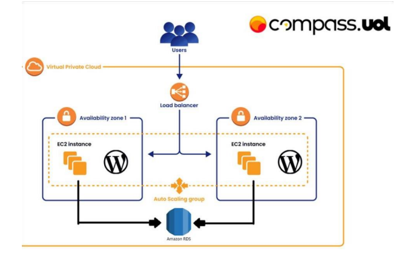
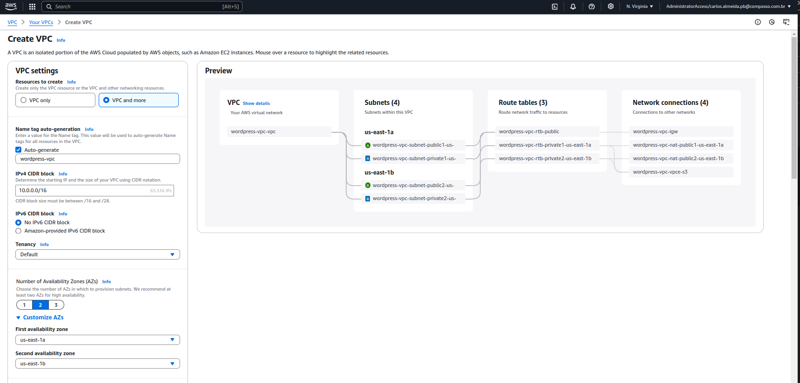
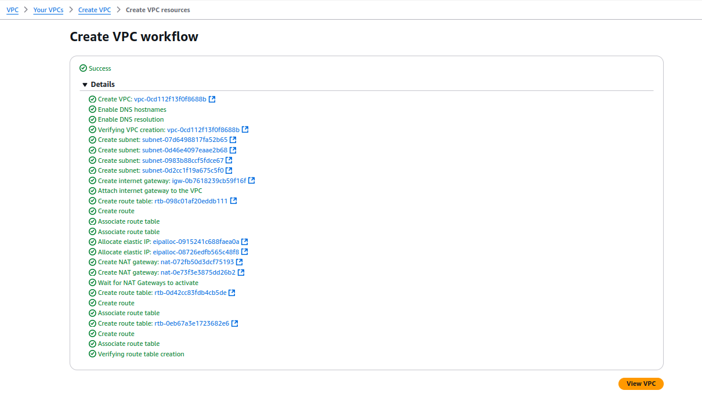
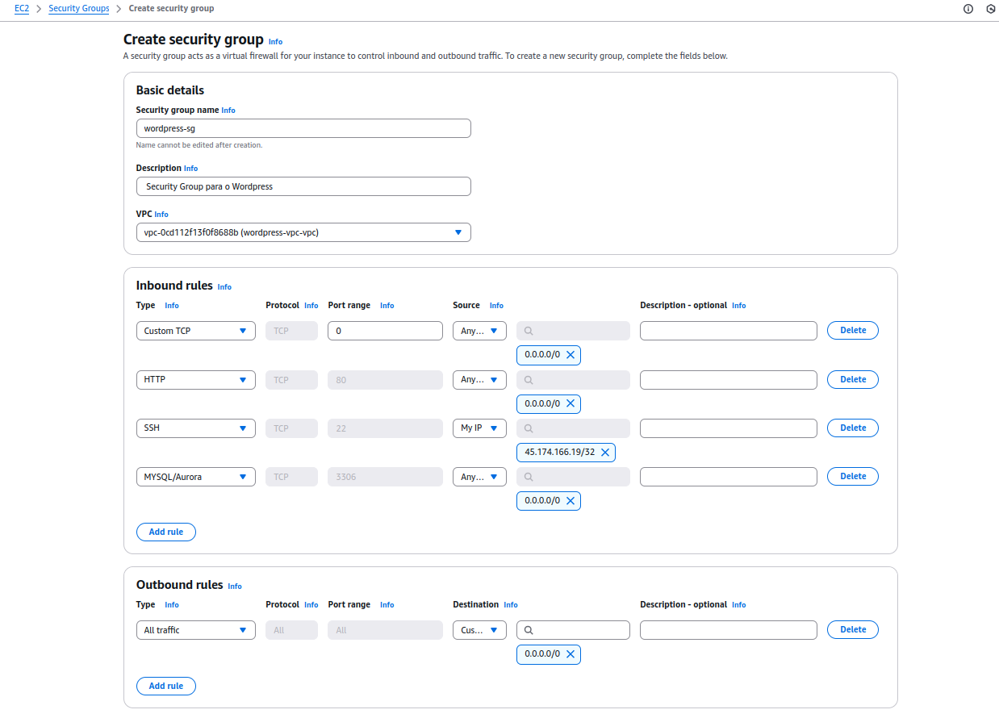
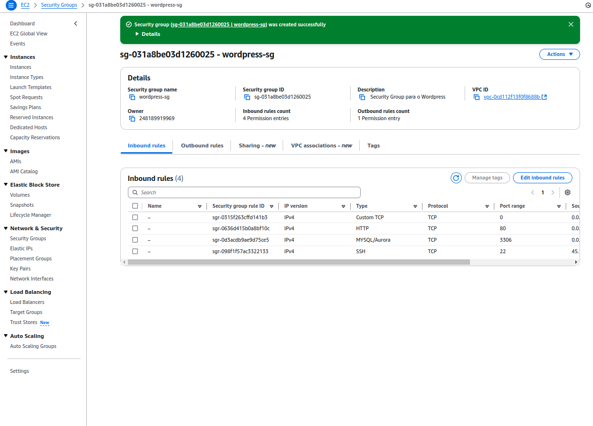
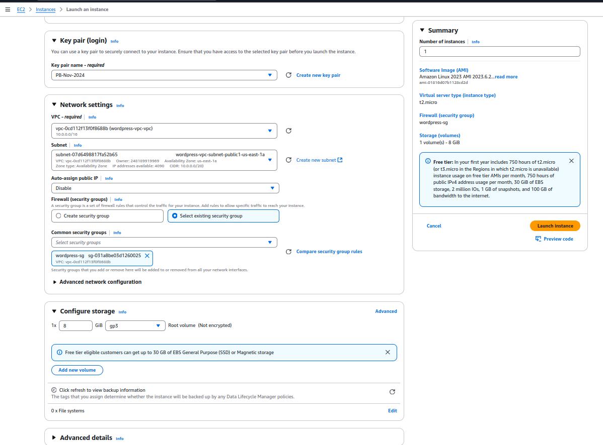
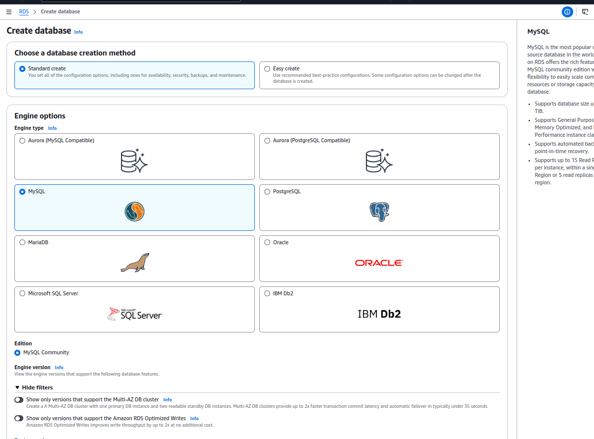
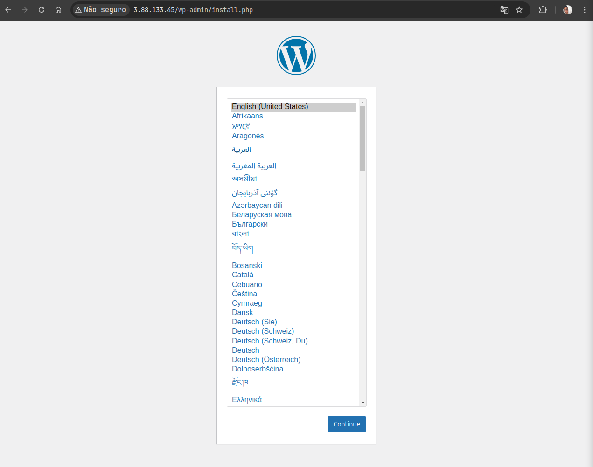
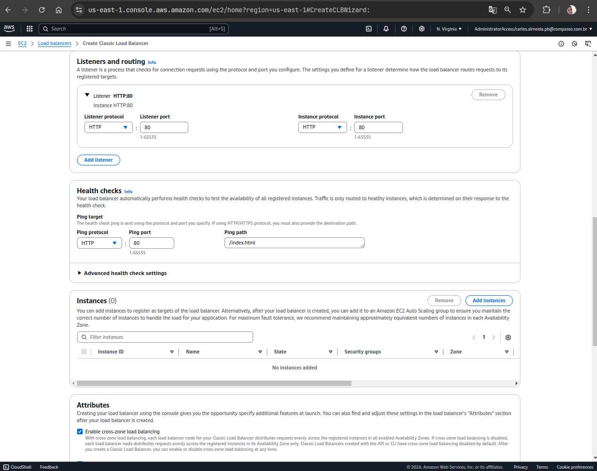
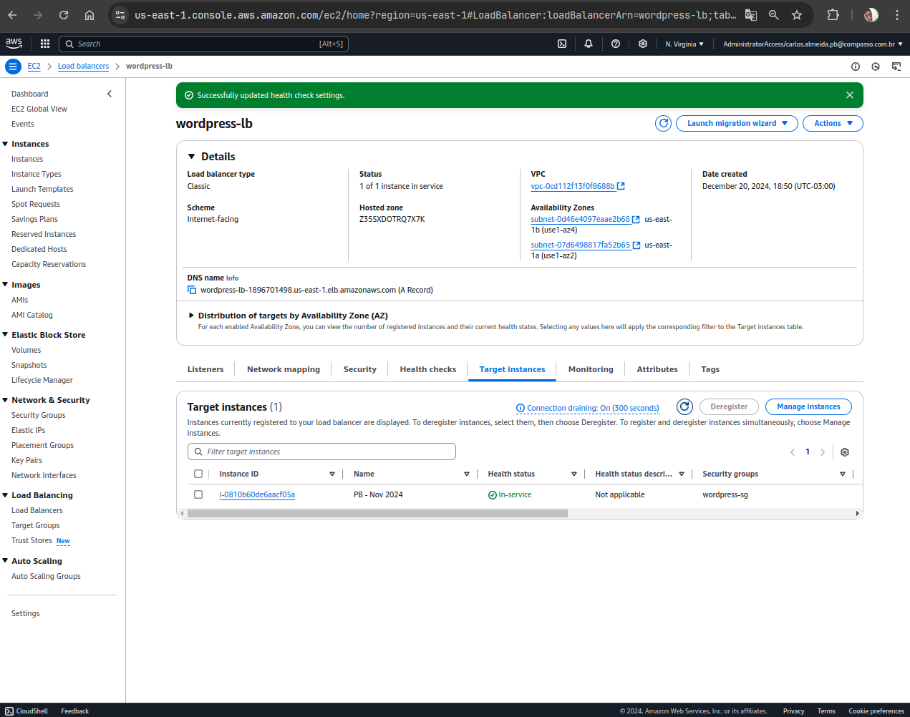

<h1 align="center">Documentação</h1>

## 📝 Sobre o projeto

  

  Este projeto é desenvolvido com o intuito de criar uma infraestrutura na AWS utilizando uma VPC, Subnets, Security Groups, EC2, RDS e um Load Balancer.

## Passo a passo para execução do projeto

### Pré-requisitos

Antes de começar, é necessário ter instalado em sua máquina as seguintes ferramentas:

- [Git](https://git-scm.com)
- [Conta na AWS](https://aws.amazon.com/pt/)
- [Conta no Docker Hub](https://hub.docker.com/)

Além disso, é bom ter um editor para trabalhar com o código, como [VSCode](https://code.visualstudio.com/).

### ☁ Criando a infraestrutura na AWS

#### 1. Criando VPC

  

- Na imagem acima, é possível visualizar a criação de uma VPC.
- Configurações:
  - Nome: `wordpress-vpc`
  - CIDR Block: `10.0.0.0/16`
  - IPv4 CIDR Block: `No IPv4 CIDR Block`
  - Tenancy: `Default`
  - Número de AZs: `2` (us-east-1a, us-east-1b)
  - Número de subnets públicas: `2`
  - Número de subnets privadas: `2`
  - NAT Gateway: `1 por AZ`
  - VPC Endpoints: `S3`

  

- Na imagem acima, a VPC foi criada com sucesso.

#### 2. Criando Security Groups

  

- Na imagem acima, é possível visualizar a criação de um Security Group.
- Configurações:
  - Nome: `wordpress-sg`
  - Descrição: `Security Group para o Wordpress`
  - VPC: `wordpress-vpc`
  - Regras de entrada:
    - Custom TCP Rule, Port Range `80`, Anywhere IPv4
    - HTTP, Port `80`, Anywhere IPv4
    - SSH, Port `22`, My IP
    - MySQL/Aurora, Port `3306`, Anywhere IPv4
  - Regras de saída:
    - All Traffic, All, Anywhere IPv4

  

- Security Group criado com sucesso.
- A configuração do banco de dados será finalizada após a criação do RDS, pois lá será possível pegar o endpoint do banco de dados.

#### 3. Criando EC2

  

- Na imagem acima, é possível visualizar a criação de uma EC2.
- Configurações:
  - Nome e tags (Importante para a criação da EC2)
  - AMI: `Amazon Linux 2023`
  - Tipo de instância: `t2.micro`

  

- Configurações adicionais:
  - Key Pair: `PB-Nov-2024` (chave utilizada para acessar a instância)
  - Configurações de rede:
    - VPC: `wordpress-vpc`
    - Subnet: `wordpress-public-subnet-1`
    - Auto-assign Public IP: `Disable` (a instância será privada e acessada pelo Load Balancer)
    - Security Group: `wordpress-sg`
  - Advanced Details: conforme o arquivo `user-data.sh`

#### 4. Criando RDS

  

- Na imagem acima, é possível visualizar a criação de um RDS.
- Selecionar o banco de dados MySQL.
- Configurações:

  - Engine options: `MySQL`
  - Version: `MySQL 8.0.25`
  - Templates: `Free tier`
  - Settings:
    - DB instance identifier: `wordpress-db`
    - Master username: `admin`
    - Master password: `exemplosenha`
  - DB instance size: `db.t2.micro`
  - Storage: `20 GB`
  - Connectivity:
    - VPC: `wordpress-vpc`
    - Subnet group: `wordpress-private-subnet-group`
    - Publicly accessible: `No`
    - VPC security group: `wordpress-sg`
  - Additional configuration:
    - Initial database name: `wordpress`

  

  - RDS criado com sucesso.
  - Após a criação, é possível visualizar o endpoint do banco de dados.
  - Esse endpoint será utilizado para configurar o Wordpress.
  - No doocker-compose.yml, é necessário alterar o endpoint o nome do banco de dados, usuário e senha.
  - acessando a ec2 e criando um banco chamado wordpress e alterando dentro do docker compose

  

  - Após a configuração do banco de dados, é possível acessar o Wordpress.
  - porém agora é necessário criar um Load Balancer para acessar o Wordpress, um efs e um auto scaling group para garantir a alta disponibilidade do serviço.

#### 5. Criando Load Balancer

  

- Na imagem acima, é possível visualizar a criação de um Load Balancer.
- Configurações:

  - Nome: `wordpress-lb`
  - Scheme: `internet-facing`
  - IP address type: `ipv4`
  - Listeners:
    - HTTP: `80`
    - Target group: `wordpress-tg`
  - Availability Zones: `us-east-1a`, `us-east-1b`
  - Security settings: `wordpress-sg`

  

  

  - Health checks:
    - Protocol: `HTTP`
    - /wp-admin/install.php
    - O load balancer precisa estar vinculado com a instância EC2.

  

  

  - Load Balancer criado com sucesso e em serviço. passando pelo health check.

#### 6. Criando EFS

#### 7. Criando Auto Scaling Group

